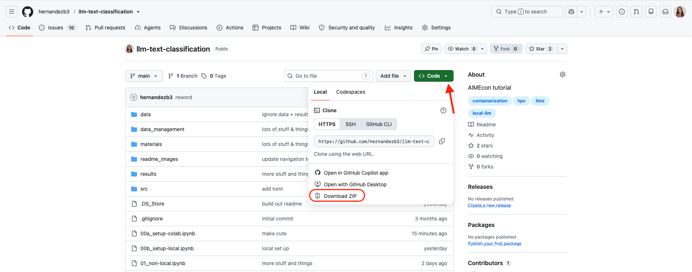
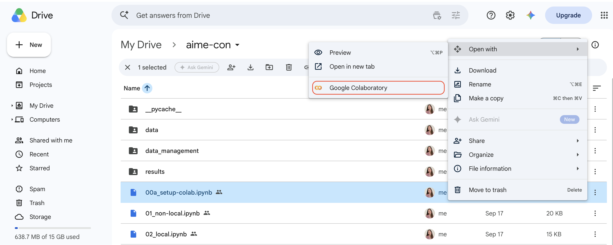

# Text Classification with Large Language Models
[AIME-Con](https://www.xcdsystem.com/ncme/program/47bbPZ3/index.cfm) 4-hour training session, *Text Classification with Large Language Models: Pipelines, Fine-tuning, and Measurement Validity*

by Brittney Hernandez, Claudia Ventura, Kylie Anglin

**Description** 

This interactive workshop covers methods of binary text classification using large language models: API calls to non-locally hosted models, local models, and finetuned models. Participants will build text-classification pipelines with an emphasis on practicalities and measurement validity. Tradeoffs in approaches (cost, performance, privacy, etc.) will be discussed throughout.

<p align="center">
    
    &nbsp;&nbsp;&nbsp;&nbsp;&nbsp;&nbsp;&nbsp;&nbsp;
  
</p>

# Prerequisite Knowledge & Skills
**Text Classification**

Conceptual understanding of text classification as a method of analysis, and/or familiarity with traditional classification methods (e.g., bag-of-words, supervised classifiers)

**LLM Mechanics**

Understanding of LLMs as next-token prediction systems, including tokenization, and a broad sense of how pre-training data shapes model behavior.

**Programming**

Proficiency in one or more programming language(s) such as Python or R. Conceptual understanding of file input/output, API calls, data manipulation, functions, and loops. 


# Prerequisite Software & Packages
Guidance for setting up prerequisite software and packages is included in this README.md. If you have any issues with software and package set-up, please post it in [Discussions](https://github.com/hernandezb3/llm-text-classification/discussions) or email brittney.hernandez@uconn.edu.

- Hugging Face Account
- Hugging Face Access Token
- Complete Community Access Agreement for Llama 3.2
- One of **Option A** or **B**:

**Option A) Colab**
- Google Drive account

**Option B) Local**
- VS Code
- Python 3.12.3

# Directory Structure
The directory structure is set up as follows:

```
├── llm-text-classification/
│   ├── data/
│   │   ├── dev.xlsx
│   │   ├── test.xlsx
│   │   └── train.xlsx
│   ├── data_management/
│   │   ├── human_prompt_codebook.docx
│   │   └── llm_prompt_codebook.xlsx
│   ├── results/
│   │   ├──local/
│   │   ├── non-local/
│   │   ├── prompt-engineering/
│   │   ├── fine-tuning/
│   │   └── classifications.txt
│   ├── README.md
│   ├── paths.py
│   ├── requirements.txt
│   ├── secrets-template.txt
│   ├── 00a_colab-setup.ipynb
│   ├── 00b_local-setup.ipynb
│   ├── 01_non-local.ipynb
│   ├── 02_local.ipynb
│   ├── 03_prompt-engineering.ipynb
│   └── 04_fine-tuning.ipynb
```

# Hugging Face
You will need to sign up for an account, create a read-only acess token, and complete the Community Access Agreement for Llama 3.2. 

Navigate to https://huggingface.co and click Sign Up. 

<p align="center">

</p>

Click on your profile icon in the top right corner and select Access Tokens. 
<p align="center">

</p>

Click on Create new Access Token and on the next page click + Create new token.
<p align="center">

</p>

Select Read Only, give the token a name and click Create Token. A pop-up window will appear with your access token. Save this somewhere secure (e.g., a password manager). 

<p align="center">

</p>

Navigate to the [Llama 3.2 1B](https://huggingface.co/meta-llama/Llama-3.2-1B-Instruct) Model Card on Hugging Face and complete the Community Access Agreement.

<p align="center">

</p>

---
# Option A) Colab

Download the [llm-text-classification](https://github.com/hernandezb3/llm-text-classification) GitHub Repo to your computer. To download, click Code, and then Download ZIP. After it downloads, find the folder in you downloads and double-click to unzip it. Edit the file name, removing `-main` from the end. The filename should read llm-text-classification.

<p align="center">

</p>

Download the `train.xlsx`, `dev.xlsx`, and `test.xlsx` files from `data-shared` below and save them to the `llm-text-classification/data/` folder.

- [data-shared](https://uconn-my.sharepoint.com/:f:/g/personal/brittney_hernandez_uconn_edu/IgBK64FIE_1zS7aIGgZqEw0VAVnvvbCgYIYqzkKFFeRBaG4?e=e482Jo)/

Confirm the path to the data looks like this:

```
├── llm-text-classification/
│   ├── data/
│   │   ├── dev.xlsx
│   │   ├── test.xlsx
│   │   └── train.xlsx
```

Upload the `llm-text-classification` folder and all it's contents (including the data you just added) to Google Drive, in My Drive. *Note.* Do not save it to a folder called Colab Notebooks.

<p align="center">

</p>


In Google Drive, navigate to the file `aime-con/00a_setup-colab.ipynb`, right click on ... and select Open with > Google Colabratory. 

<p align="center">

</p>

#### Colab set up continues in `00a_setup-colab.ipynb` once it opens in Google Colab.

---
# Option B) Local

- Download [Visual Studio Code](https://code.visualstudio.com) (VS Code)
- Download [Python 3.12.3](https://www.python.org/downloads/release/python-3123/)

Clone the [llm-text-classification](https://github.com/hernandezb3/llm-text-classification) GitHub Repo to your computer.

Open your OS's Command Line Interface (Terminal for Mac or Command Prompt for Windows). Change your directory to the location where you want to save the repo.
```
cd path/to/folder/
```

Clone the repo.
```
git clone https://github.com/hernandezb3/llm-text-classification.git
```

Download the `train.xlsx`, `dev.xlsx`, and `test.xlsx` files from `data-shared` below and save them to the `data/` folder in your cloned repo. *Note* There is a .gitignore file in the data file that keeps any data from being pushed to GitHub.

- [data-shared](https://uconn-my.sharepoint.com/:f:/g/personal/brittney_hernandez_uconn_edu/IgBK64FIE_1zS7aIGgZqEw0VAVnvvbCgYIYqzkKFFeRBaG4?e=e482Jo)/

Confirm the path to the data looks like this:

```
├── llm-text-classification/
│   ├── data/
│   │   ├── dev.xlsx
│   │   ├── test.xlsx
│   │   └── train.xlsx
```
Open VS Code. Click Open, navigate to the llm-text-classification folder of the repo you just cloned, and click Open.

<p align="center">

</p>

#### To continue local set up, open `00b_setup-local.ipynb` from the Explorer tab in VS Code.

<p align="center">

</p>
