# Text Classification with Large Language Models
[AIME-Con](https://www.xcdsystem.com/ncme/program/47bbPZ3/index.cfm) 4-hour training session, *Text Classification with Large Language Models: Pipelines, Fine-tuning, and Measurement Validity*

by Brittney Hernandez, Ph.D.; Claudia Ventura, M.A.; Kylie Anglin, Ph.D.

**Description** 

This interactive workshop covers methods of binary text classification using large language models: API calls to non-locally hosted models, local models, and finetuned models. Participants will build text-classification pipelines with an emphasis on practicalities and measurement validity. Tradeoffs in approaches (cost, performance, privacy, etc.) will be discussed throughout.

<p align="center">
  
  &nbsp;&nbsp;&nbsp;&nbsp;&nbsp;&nbsp;&nbsp;&nbsp;
  
  &nbsp;&nbsp;&nbsp;&nbsp;&nbsp;&nbsp;&nbsp;&nbsp;
  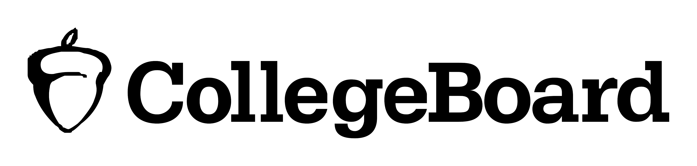

</p>


Project Focus is supported by Javits Gifted and Talented Students Education Grant Program, PR/Award Number S206A230027, as administered by the OESE, U.S. Department of Education.

# Prerequisite Knowledge & Skills
**Text Classification**

Conceptual understanding of text classification as a method of analysis, and/or familiarity with traditional classification methods (e.g., bag-of-words, supervised classifiers)

**LLM Mechanics**

Understanding of LLMs as next-token prediction systems, including tokenization, and a broad sense of how pre-training data shapes model behavior.

**Programming**

Proficiency in one or more programming language(s) such as Python or R. Conceptual understanding of file input/output, API calls, data manipulation, functions, and loops. 


# Prerequisite Software & Packages
Guidance for setting up prerequisite software and packages is included in this README.md. If you have any issues with software and package set-up, please post it in [Discussions](https://github.com/hernandezb3/llm-text-classification/discussions) or email brittney.hernandez@uconn.edu.

- GitHub Account
- Hugging Face Account
- Hugging Face Access Token
- Complete the Community Access Agreement for Llama 3.2 on Hugging Face
- One of **Option A** or **B**:

**Option A) Colab** *(Preferred)*
- Google Drive account

**Option B) Local**
- VS Code
- Git
- Python 3.12.3

*Note.* The session will be run in Google Colab, but Option B is included as a free alternative for those who might have used all of their compute on Colab or storage on Google Drive.

# Directory Structure
The directory structure is set up as follows:

```
├── llm-text-classification/
│   ├── data/
│   │   ├── dev.xlsx
│   │   ├── test.xlsx
│   │   └── train.xlsx
│   ├── data_management/
│   │   ├── empirical_prompts_50.csv
│   │   ├── human_prompt_codebook.docx
│   │   ├── llm_prompt_codebook.xlsx
│   │   └── empirical_prompt_variants.docx
│   ├── results/
│   │   ├── local/
│   │   ├── non-local/
│   │   ├── prompt-engineering/
│   │   ├── fine-tuning/
│   │   └── classification.txt
│   ├── README.md
│   ├── requirements.txt
│   ├── dot_env.txt
│   ├── 00_intro.ipynb
│   ├── 01_inference.ipynb
│   ├── 04_fine-tuning.ipynb
│   └── test-local.py
```

# Hugging Face
You will need to sign up for an account, create a read-only acess token, and complete the Community Access Agreement for Llama 3.2. 

Navigate to https://huggingface.co and click Sign Up. 

<p align="center">

</p>

Click on your profile icon in the top right corner and select **Access Tokens**. 
<p align="center">

</p>

Click on **Create new Access Token** and on the next page click **+ Create new token**.
<p align="center">

</p>

Select **Read Only**, give the token a name and click **Create Token**. A pop-up window will appear with your access token. Save this somewhere secure (e.g., a password manager). 

<p align="center">

</p>

Navigate to the [Llama 3.2 1B](https://huggingface.co/meta-llama/Llama-3.2-1B-Instruct) Model Card on Hugging Face and complete the Community Access Agreement.

<p align="center">

</p>

---
# Option A) Colab

Navigate to https://colab.research.google.com and click **+ New Notebook**. 

<p align="center">
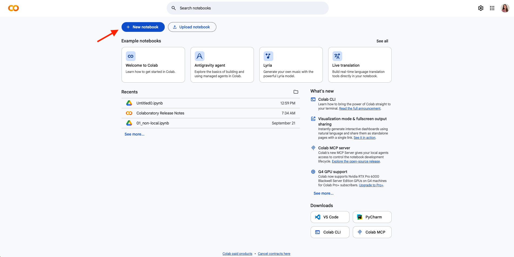
</p>

To add a new chunk of code to your notebook click **+ Code**. Run each chunk of code by clicking the ▶️ button. 

<p align="center">
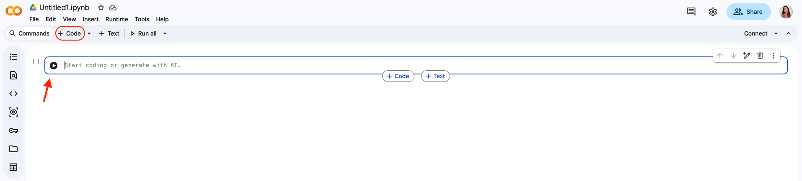
</p>

### Clone the GitHub repo
Copy, paste, and run the code below into a code chunk in your new Colab Notebook. It will import some packages.
```
import os
from google.colab import drive
from google.colab import userdata
```

Mount your Google Drive account to the Colab notebook. You will be prompted to sign in to Google Drive and grant the notebook access to your account.
```
drive.mount('/content/drive/')
```

Change your directory to MyDrive. 
```
os.chdir("./drive/MyDrive/")
```

Clone the GitHub repository to your Google Drive.
```
!git clone https://github.com/hernandezb3/llm-text-classification.git
```

### Upload Data to Google Drive
Navigate to Google Drive. You should now see a folder called `llm-text-classification` in My Drive.

<p align="center">

</p>

Go into the `llm-text-classification/` folder and then into the the `data/` folder.

In a new tab, go to this OneDrive link, a folder called [data-shared/](https://uconn-my.sharepoint.com/:f:/g/personal/brittney_hernandez_uconn_edu/IgBK64FIE_1zS7aIGgZqEw0VAVnvvbCgYIYqzkKFFeRBaG4?e=e482Jo). Download the `train.xlsx`, `dev.xlsx`, and `test.xlsx` files from `data-shared/`. Upload them to the `llm-text-classification/data/` folder in Google Drive.

*Note.* The `data-shared/` folder is password-protected. You will receive an email before the training session that includes a 1Password Item with a password to `data-shared/`. 

Return to your Google Colab notebook and run,
```
os.listdir("./llm-text-classification/data/")
```
Your output should include train.xlsx, dev.xlsx, and test.xlsx.

### Save Secrets
Navigate to the left panel and click on 🔑 **Secrets**. Use **+ Add new secret** to add two new secrets and `HF_TOKEN` and `OPENAI_API_KEY`. 


<p align="center">
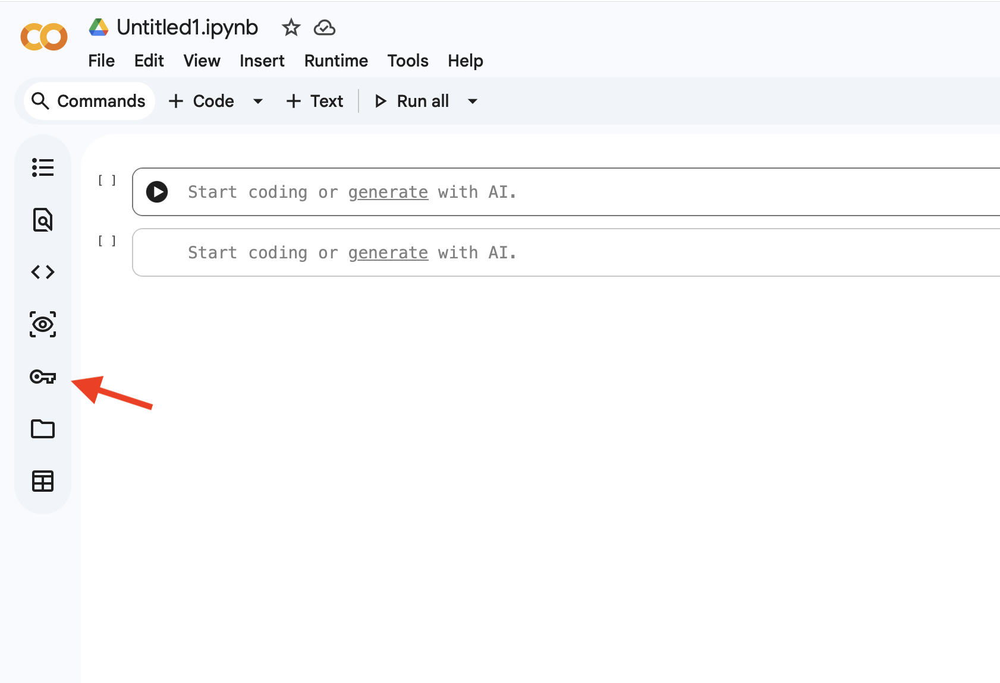
</p>

Add your Hugging Face token to Secrets. Name it `HF_TOKEN` and add your token to the Value column. 

Add the Open AI key to Secrets. Name it `OPENAI_API_KEY` and add the key shared in the 1Password Item. 

Toggle **Notebook access** on for both keys. 
<p align="center">
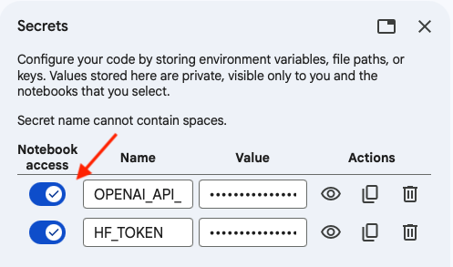
</p>

Check that your secrets loaded by running,
```
os.environ["HF_TOKEN"] = userdata.get('HF_TOKEN')
```
and
```
os.environ["OPENAI_API_KEY"] = userdata.get('OPENAI_API_KEY')
```

### Run a Test
Test your Hugging Face Token:
```
from huggingface_hub import login, HfApi
login(token = os.getenv("HF_TOKEN"))
client = HfApi()
client.model_info("meta-llama/Llama-3.2-1B")
```
If it works, it will print the Community Access Agreement.

Test the Open AI Key:
```
from openai import OpenAI
client = OpenAI()
client.models.list()
```
If it works, it will print information about different Open AI models. 


Your output should look like this:
<p align="center">
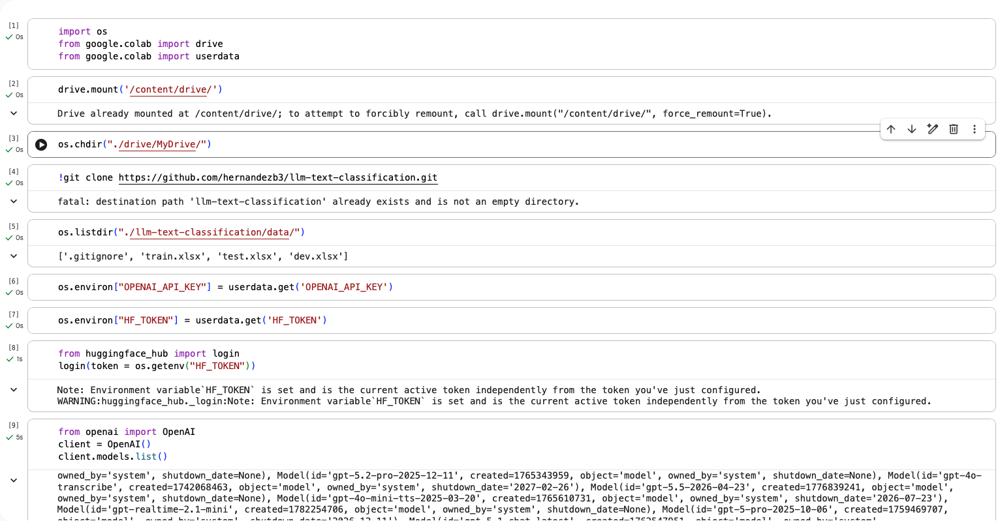
</p>

### ON THE DAY OF THE SESSION:
### Update the GitHub Repo in Google Drive
In a new Colab Notebook, run,
```
import os
from google.colab import drive
from google.colab import userdata

drive.mount('/content/drive/')
os.chdir("./drive/MyDrive/llm-text-classification/")

!git fetch origin
!git reset --hard origin/main

os.environ["HF_TOKEN"] = userdata.get('HF_TOKEN')
os.environ["OPENAI_API_KEY"] = userdata.get('OPENAI_API_KEY')
```

---
# Option B) Local

- Download [Visual Studio Code](https://code.visualstudio.com) (VS Code)
- Download [Git](https://github.com/git-guides/install-git)
- Download [Python 3.12.3](https://www.python.org/downloads/release/python-3123/)

### Clone the GitHub repo
Clone the [llm-text-classification](https://github.com/hernandezb3/llm-text-classification) GitHub Repo to your computer.

To do this, open your OS's Command Line Interface (CLI; Terminal for Mac or Command Prompt for Windows). Copy, paste, and run the commands below in your CLI. 

Change directory to wherever you want to save the repo.
```
cd path/to/folder/
```

Clone the repo.
```
git clone https://github.com/hernandezb3/llm-text-classification.git
```

### Upload Data
Go to the, [data-shared/](https://uconn-my.sharepoint.com/:f:/g/personal/brittney_hernandez_uconn_edu/IgBK64FIE_1zS7aIGgZqEw0VAVnvvbCgYIYqzkKFFeRBaG4?e=e482Jo) OneDrive link. 

*Note.* The `data-shared/` folder is password-protected. You will receive an email before the training session that includes a 1Password Item with a password to `data-shared/`. 

Download the `train.xlsx`, `dev.xlsx`, and `test.xlsx` files from `data-shared/`. Move them to the `data/` folder of your cloned repo. 

*Note.* There is a .gitignore file in the folder that keeps any data from being pushed to GitHub.

Return to the CLI and run,
```
os.listdir("./llm-text-classification/data/")
```
Your output should include `train.xlsx`, `dev.xlsx`, and `test.xlsx`. Close out of your CLI.

### Save Secrets
Open VS Code. Click Open, navigate to the `llm-text-classification` folder of the repo you just cloned, and click Open.

<p align="center">

</p>

Click the Explorer tab. 
<p align="center">
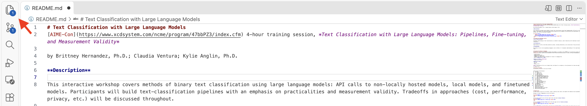
</p>

Open the file called `dot-env.txt`. 
Add your Hugging Face to `HF_TOKEN = "hf_..."` token in quotes. 

Add the Open AI key to `OPENAI_API_KEY = sk-...`. The key is in the 1Password Item shared via email. 

Save the file, close out of it, and rename the file to `.env`

### Create a Virtual Environment
Use the VS Code shortcut: CMD + SHIFT + P (on a Mac) or CTRL + SHIFT + P (on a PC) and select the following:
- Python: Create Environment 
- venv
- Python 3.12.3
- Name it `.venv` & press ENTER
- Select install project dependencies
- Check the box next to requirements.txt & click OK
- Select .venv as the kernel

<p align="center">
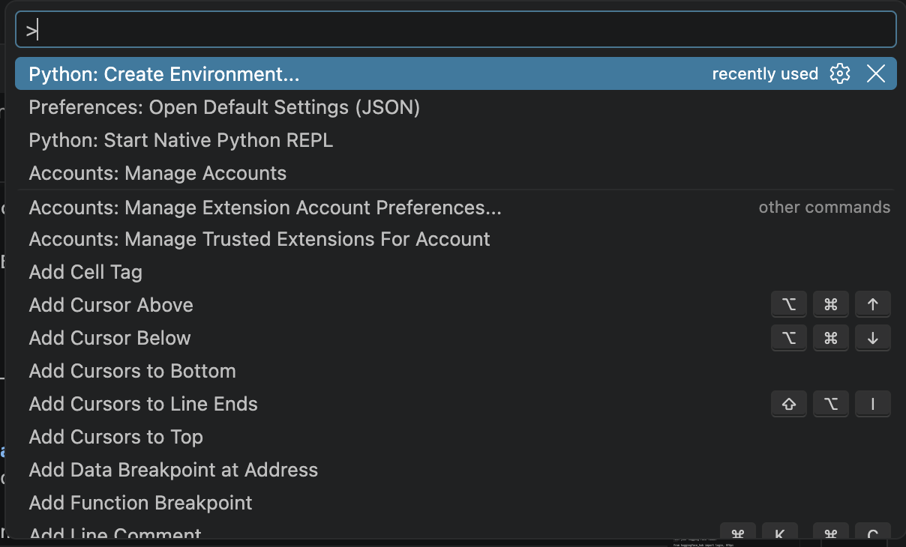
</p>

<p align="center">
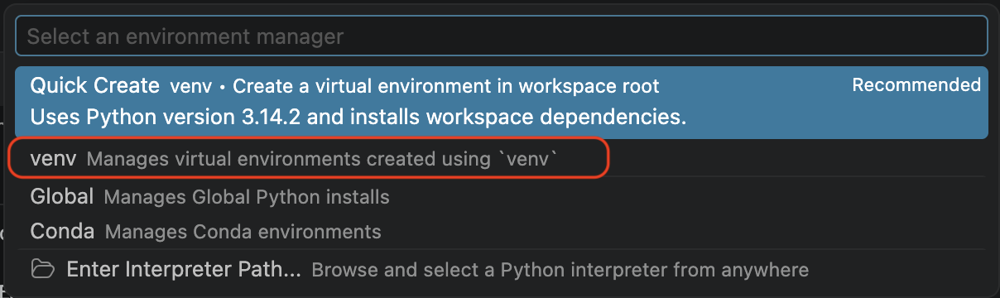
</p>

<p align="center">
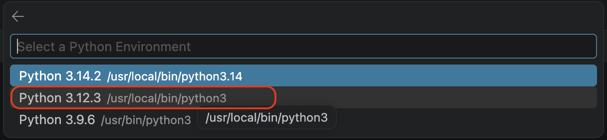
</p>

<p align="center">
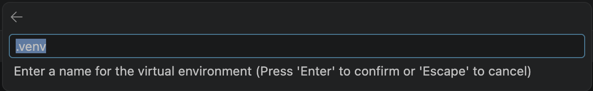
</p>

<p align="center">
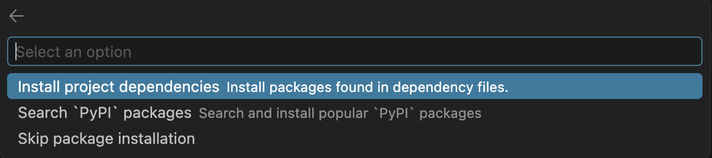
</p>

<p align="center">
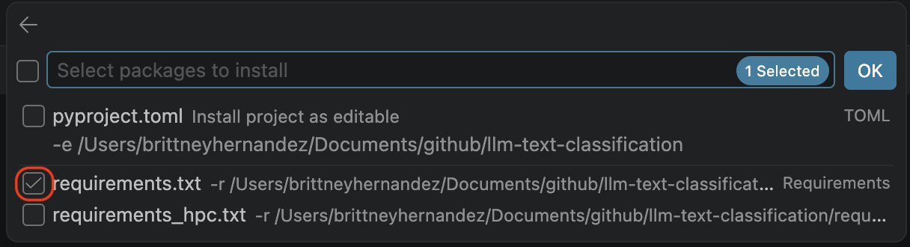
</p>

In VS Code, navigate to Terminal > New Terminal. You should see (.venv) in the terminal window. This means your virtual environment was activated.

### Run a Test
In VS Code Terminal, test your secrets loaded correctly. Copy and paste the command below and press enter to run it.

```
python3 test-local.py
```

If it works you'll see ✅ Setup Complete.

### ON THE DAY OF THE SESSION:
### Update the GitHub Repo Locally
Set your working directory to the llm-text-classification folder
```
cd path/to/llm-text-classification
```
and pull any updates to the repo,

```
git pull origin main
```

If you're met with an error `fatal: not a git repository (or any of the parent directories): .git` it means your working directory is not a GitHub repo. To check run,
```
ls -all
```
This should show a hidden file called `.git` inside your working directory. Change your directory to the llm-text-classification with the `.git` folder. 